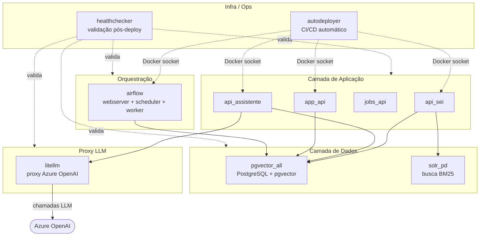
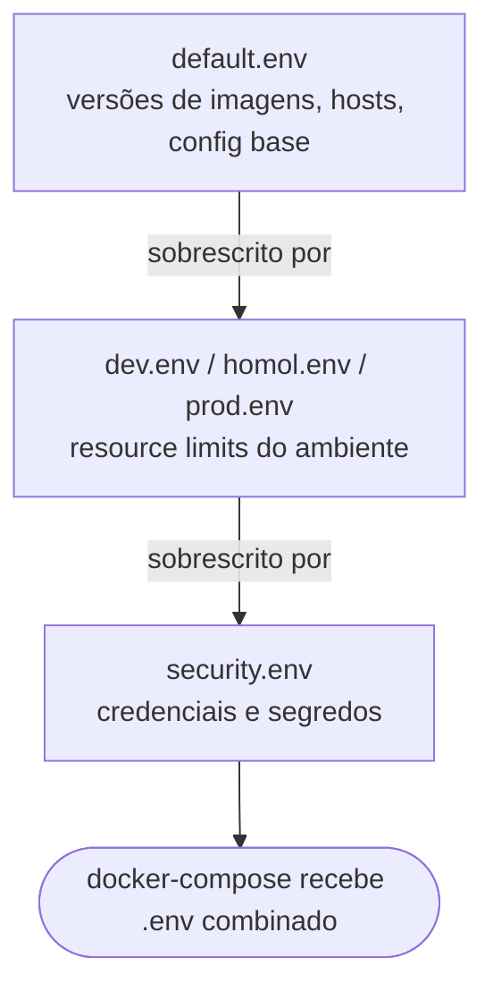
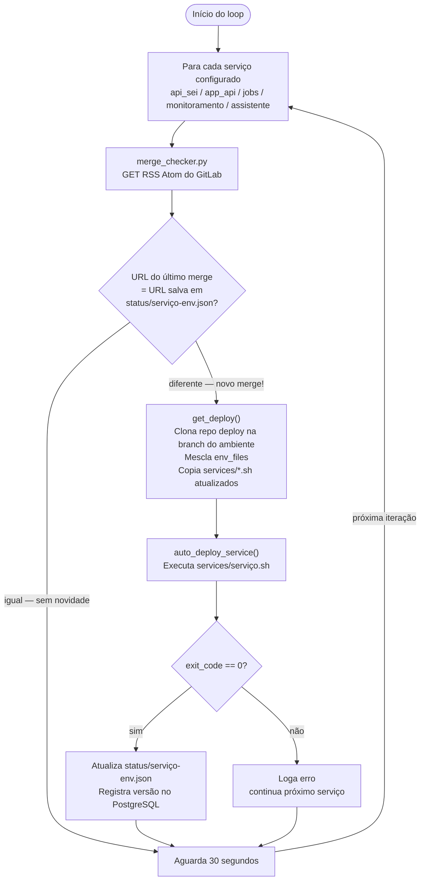
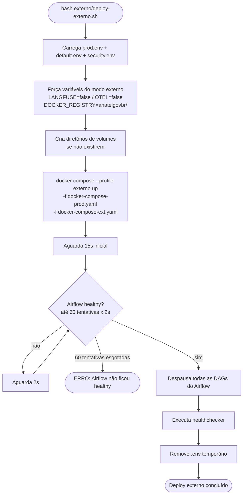
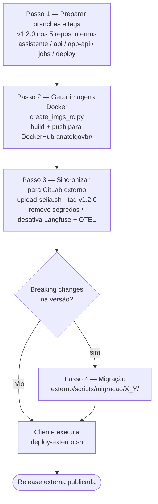
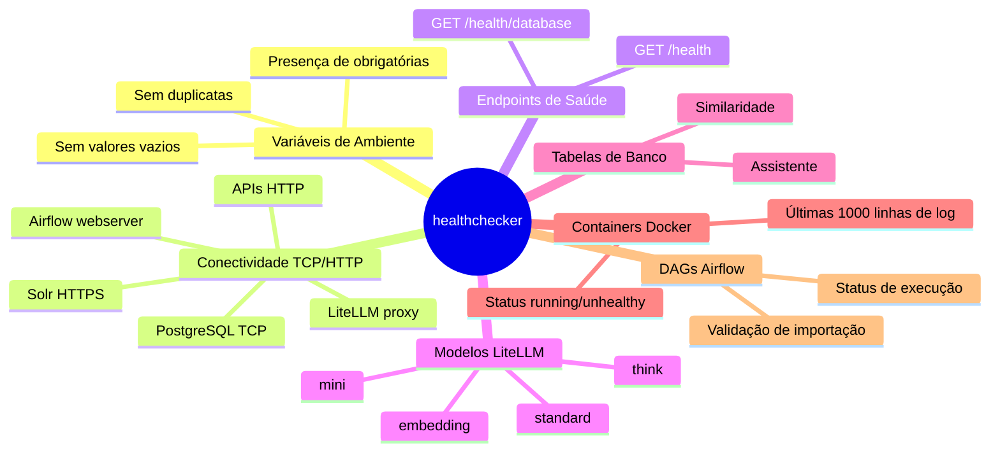
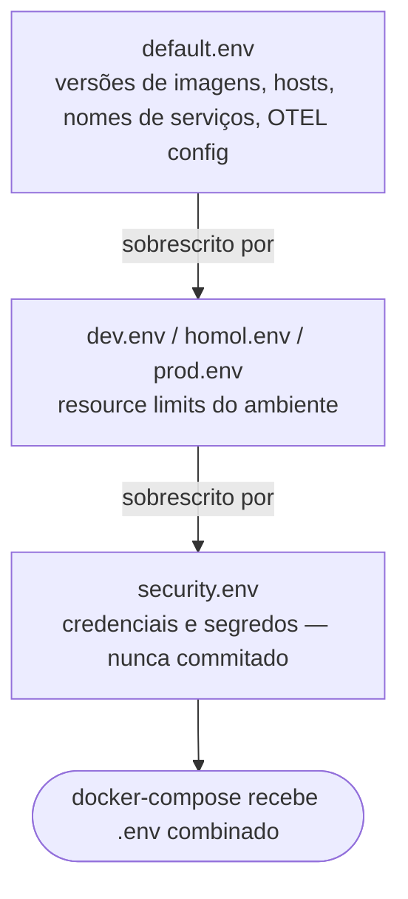

# Aula: Arquitetura de Deploy do SEI-IA

> **Público-alvo:** Novos colaboradores do projeto SEI-IA.
> **Objetivo:** Entender como o sistema é implantado, atualizado e monitorado — tanto no ambiente interno (Anatel) quanto no externo (clientes/órgãos parceiros).

---

## Módulo 1 — Visão Geral da Arquitetura

### O "mapa" do sistema

O repositório `sei-similaridade/deploy` centraliza toda a infraestrutura como código. Ele cobre **quatro contextos de operação**:

| Contexto | Descrição |
|---|---|
| `interno-dev` | Ambiente de desenvolvimento na Anatel |
| `interno-homol` | Ambiente de homologação na Anatel |
| `interno-prod` | Ambiente de produção na Anatel |
| `externo` | Deploy em clientes/órgãos parceiros |

### Serviços que rodam no sistema



### Arquivos-chave do repositório

| Arquivo | Finalidade |
|---|---|
| `deploy.sh` | Entrypoint do deploy interno |
| `externo/deploy-externo.sh` | Entrypoint do deploy externo |
| `docker-compose-prod.yaml` | Definição de todos os serviços (~30KB) |
| `docker-compose-dev.yaml` | Overrides de portas para dev/homol |
| `docker-compose-ext.yaml` | Overrides para o deploy externo |
| `docker-compose-autodeployer.yml` | Container do autodeployer |
| `docker-compose-healthchecker.yml` | Container do healthchecker |
| `env_files/default.env` | Versões de imagens e configuração base |
| `env_files/security.env` | Credenciais (não commitado, gerado localmente) |
| `llm_config/litellm_config_example.yaml` | Template de configuração do proxy LLM |

---

## Módulo 2 — Deploy Interno

### Visão geral

O deploy interno é executado manualmente rodando `deploy.sh` com o argumento do ambiente desejado. É o ponto de entrada para subir ou atualizar a stack na Anatel.

### 2.1 Fluxo do `deploy.sh`

```mermaid
flowchart TD
    A(["bash deploy.sh --dev / --homol / --prod"]) --> B["Carrega env_files<br>default.env + ambiente.env + security.env"]    B --> C["Mapeia ambiente para branch git<br>dev=desenvolvimento / homol=homologacao / prod=master"]
    C --> D["Clona repositório jobs em tmp/"]
    D --> E{"Hash pgvector_all<br>mudou?"}
    E -->|sim| F["docker compose up pgvector_all<br>--build --force-recreate"]
    E -->|não| G["Pula redeploy<br>pgvector_all inalterado"]
    F --> H{"Hash solr_pd<br>mudou?"}
    G --> H
    H -->|sim| I["docker compose up solr_pd<br>--build --force-recreate"]
    H -->|não| J["Pula redeploy<br>solr_pd inalterado"]
    I --> K["Sobe litellm<br>sempre recria"]
    J --> K
    K --> L["Sobe autodeployer<br>--build --force-recreate"]
    L --> M["Sobe healthchecker<br>aguarda conclusão"]
    M --> N(["Deploy concluído"])
```

**Deploy incremental:** O cálculo de hash evita recriar serviços quando os arquivos de configuração não mudaram. Isso reduz downtime desnecessário.

#### Como o hash é calculado

```bash
# Exemplo real do script:
FILES_PGVECTOR_ALL="./docker-compose-prod.yaml ./docker-compose-dev.yaml \
                    ./env_files/* ./pgvector_all.dockerfile \
                    ./backup/* ./database_init/conf/*"

HASH=$(find -type f \( -path $FIND_PATH \) \
    -exec sha256sum {} + | sort | awk '{print $1}' | sha256sum | awk '{print $1}')
```

O hash é salvo em um volume Docker chamado `sei_ia_hashes_vol` para persistir entre execuções.

### 2.2 Hierarquia de ambientes

```
env_files/
├── default.env   ← base: versões de imagens, hosts, nomes de cores Solr
├── dev.env       ← resource limits reduzidos (desenvolvimento)
├── homol.env     ← resource limits intermediários
├── prod.env      ← resource limits de produção (CPUs e memória máximos)
└── security.env  ← credenciais (NÃO commitado no git)
```

Os arquivos são carregados em camadas — os mais específicos sobrescrevem os mais genéricos:



#### Exemplo de `default.env` (versões de imagens)

```bash
export API_SEI_IMAGE="1.2.0"
export API_ASSISTENTE_VERSION="1.2.3"
export AIRFLOW_IMAGE_NAME="1.2.7"
export APP_API="1.1.4"
export SOLR_CONTAINER="1.1.0"
export POSTGRES_IMAGE="1.1.1"

export SOLR_HOST="solr-seiia"
export SOLR_MLT_JURISPRUDENCE_CORE="documentos_bm25"
export SOLR_MLT_PROCESS_CORE="processos_bm25"

export VOL_SEIIA_DIR="/var/seiia/volumes"
```

### 2.3 Profiles Docker Compose

O `docker-compose-prod.yaml` usa profiles para ativar grupos de serviços:

| Profile | Serviços ativados |
|---|---|
| `--profile all` | Todos os serviços |
| `--profile airflow` | Stack completa do Airflow (webserver, scheduler, worker, triggerer, postgres, redis, rabbitmq) |  
| `--profile externo` | Serviços extras para deploy externo |
| `--profile postgres` | Apenas o pgvector_all |
| `--profile solr` | Apenas o solr_pd |

---

## Módulo 3 — Autodeployer

### O que é

O autodeployer é o **CI/CD interno** do SEI-IA. Roda como container Docker e monitora os repositórios no GitLab da Anatel. Quando detecta um merge, faz o redeploy automático do serviço afetado.

> **Importante:** O autodeployer só existe no deploy interno. Clientes externos fazem deploy manualmente via `deploy-externo.sh`.

### Componentes

```
autodeployer/
├── app_monitor.py            ← Loop principal (30s)
├── merge_checker.py          ← Lê RSS Atom do GitLab
├── deploy_version_manager.py ← Registra versões no PostgreSQL
├── utils.py                  ← Helpers: stdout em tempo real, leitura de setup.cfg
├── setup.cfg                 ← Mapa: serviço → branch → RSS → path local
├── services/
│   ├── jobs.sh               ← Deploy do Airflow + jobs
│   ├── api_sei.sh            ← Deploy da API SEI
│   ├── app_api.sh            ← Deploy da app-api
│   ├── assistente.sh         ← Deploy do assistente
│   └── monitoramento.sh      ← Deploy do monitoramento
└── status/                   ← Arquivos JSON com estado de cada serviço
```

### Mapa de serviços (`setup.cfg`)

```ini
[autodeploy_envs]
api_sei      = dev,homol,prod
app_api      = dev,homol,prod
jobs         = dev,homol,prod
monitoramento = dev,homol,prod
assistente   = dev,homol,prod

[rss_link_main_branch]
api_sei = https://git.anatel.gov.br/.../api/-/merge_requests.atom?...&target_branch=master
app_api = https://git.anatel.gov.br/.../app-api/-/merge_requests.atom?...&target_branch=master
jobs    = https://git.anatel.gov.br/.../jobs/-/merge_requests.atom?...&target_branch=main
...
```

### Fluxo de operação (a cada 30 segundos)



### Script de deploy de serviço: `services/jobs.sh`

O `jobs.sh` é o mais complexo. Ele:

1. Clona o repositório `jobs` na branch correta
2. Copia os Dockerfiles do jobs para o diretório de deploy
3. Copia os arquivos de DAG para o volume do Airflow via container temporário Alpine
4. Rebuilda as imagens `airflow-webserver-pd` e `jobs_api`
5. Sobe toda a stack Airflow (`--profile airflow`)
6. Despausa todas as DAGs

```bash
# Copia DAGs para o volume usando container temporário
container_temp_id=$(docker run --rm -v sei_similaridade_deploy_airflow_jobs_vol:/target --detach alpine sleep infinity)   
docker cp "$local_path/jobs/." "$container_temp_id:/target/"
docker stop "$container_temp_id"
```

### Container do autodeployer

Configurado em `docker-compose-autodeployer.yml`:

- Monta `/var/run/docker.sock` → permite gerenciar containers do host
- Monta `./autodeployer/status/` → persiste estado de cada serviço entre restarts
- Monta `./env_files/security.env` → acesso às credenciais
- Limite de memória: **1 GB**
- Logs em: `/var/log/autodeployer/autodeployer.log`
- `restart: on-failure` → reinicia automaticamente em caso de erro

### Observar o autodeployer em execução

```bash
# Ver logs em tempo real
docker logs autodeployer --follow

# Ver estado atual de cada serviço
cat autodeployer/status/*-details.json

# Exemplo de conteúdo do status:
# {"url_last_merge": "https://git.anatel.gov.br/.../merge_requests/123", "deployed": true}
```

---

## Módulo 4 — Deploy Externo

### Diferenças em relação ao deploy interno

| Aspecto | Interno | Externo |
|---|---|---|
| OpenTelemetry (OTEL) | Ativado | **Desativado** |
| Langfuse (logging LLM) | Ativado | **Desativado** |
| Autodeployer | Sim | **Não** |
| Ambientes | dev, homol, prod | **Apenas prod** |
| Certificados SSL | Gerenciados internamente | Scripts de instalação incluídos |
| Docker profile | `all` | `externo` |
| Deploy | `bash deploy.sh --prod` | `bash externo/deploy-externo.sh` |

### Fluxo do `externo/deploy-externo.sh`



### Override para externo: `docker-compose-ext.yaml`

Este arquivo sobrescreve configurações do `docker-compose-prod.yaml` para o contexto externo:

- **`api_sei`**: monta certificados SSL e usa bind diferente
- **`api_assistente`**: desativa métricas OTEL

---

## Módulo 5 — Fluxo para Criar uma Release Externa

### Convenção de versão

- Branch e tag nos 5 repositórios internos: `1.2.0` / `v1.2.0`

### Visão geral do processo



### Repositórios envolvidos

1. `assistente`
2. `api` (api_sei)
3. `app-api`
4. `jobs`
5. `deploy`

### Passo 1 — Preparar branches e tags nos repos internos

Criar a branch `1.2.0` e tag `v1.2.0` em cada repositório na versão desejada.

### Passo 2 — Gerar imagens Docker (`externo/create_imgs_rc.py`)

```bash
docker login -u anatelgovbr  # credenciais do Painel de Produção
source .venv/bin/activate
python externo/create_imgs_rc.py
```

Para cada repositório, o script:
1. Clona do GitLab interno na tag especificada
2. Faz build da imagem Docker com o Dockerfile correto
3. Push para DockerHub (`anatelgovbr/<imagem>:<versão>`)

### Passo 3 — Sincronizar código para GitLab externo (`externo/upload-seiia.sh`)

```bash
cd externo && sh upload-seiia.sh --tag v1.2.0
```

O script:
- Clona do GitLab interno pela tag
- **Remove** variáveis sensíveis de `security.env` (mantém apenas o template)
- **Desativa** features internas (Langfuse, telemetria OTEL)
- Ajusta `default.env` para configuração de cliente (usa `anatelgovbr/` como registry)
- Substitui arquivos por versões específicas do externo
- Push para o GitLab externo

### Passo 4 — Migração (se houver breaking changes)

Scripts em `externo/scripts/migracao/<versao_origem>_<versao_destino>/`:
- Mapeamento de variáveis de ambiente antigas → novas
- Ajuste de volumes bind

O manual completo está em `externo/docs/manual_gerar_release_externa.md`.

---

## Módulo 6 — Healthchecker

### O que é

O healthchecker é uma suite de testes que valida se todos os componentes do sistema estão funcionando corretamente após um deploy. É executado como último passo tanto do deploy interno quanto do externo.

### Estrutura

```
teste.py          ← entrypoint (chama test_all())
tests/
├── __init__.py   ← define test_all()
├── env_tests.py
├── connectivity_tests.py
├── docker_tests.py
├── airflow_tests.py
└── db_connect.py
healthcheck/
├── pgvector.sh
├── solr.sh
├── api_sei.sh
├── app_api.sh
└── airflow_scheduler.sh
```

### O que é verificado



#### Scripts individuais (`healthcheck/*.sh`)

```bash
# pgvector.sh
pg_isready -h $DB_SEIIA_HOST -p $DB_SEIIA_PORT

# solr.sh
curl -k -u $SOLR_USER:$SOLR_PASSWORD \
     "$SOLR_ADDRESS/solr/$SOLR_MLT_PROCESS_CORE/select?q=*:*&rows=0"
```

### Saídas geradas

Os resultados são salvos em `/opt/sei-ia-storage/logs/<data>/`:

| Arquivo | Conteúdo |
|---|---|
| `resumo_df.csv` | Contagem de erros por categoria |
| `conn_df.csv` | Resultado dos testes de conectividade |
| `health_df.csv` | Resultado dos endpoints `/health` |
| `containers_status_df.csv` | Status dos containers |
| `table_*.csv` | Verificação das tabelas de banco |
| `solr_df.csv` | Status dos cores Solr |
| `airflow_dags_df.csv` | Status das DAGs |
| `*.zip` | Arquivo com todos os relatórios |

### Executar manualmente

```bash
docker compose -f docker-compose-healthchecker.yml up --build

# Ver resultados
ls /opt/sei-ia-storage/logs/$(date +%Y-%m-%d)/
```

---

## Módulo 7 — Variáveis de Ambiente

### 7.1 Hierarquia de carregamento



### 7.2 `security.env` — Conteúdo e restrições

O `security.env` é gerado localmente a partir de `env_files/security.env.example`.

#### Seção Geral

```bash
export ENVIRONMENT=prod          # tipo do ambiente: dev, homol, prod
export GID_DOCKER=****           # GID do grupo docker no host
                                 # obtido com: cat /etc/group | grep ^docker: | cut -d: -f3
```

#### Banco de Dados

```bash
export DB_SEIIA_USER=****
export DB_SEIIA_PWD=****
# ATENÇÃO: a senha NÃO pode conter:
# ' " \ espaço $ ( ) : @ ; ` & * + - = / ? ! [ ] { } < > | % ^ ~
```

#### Airflow

```bash
export _AIRFLOW_WWW_USER_USERNAME=seiia
export _AIRFLOW_WWW_USER_PASSWORD=****
export AIRFLOW_POSTGRES_USER=seiia
export AIRFLOW_POSTGRES_PASSWORD=****
export AIRFLOW_AMQP_USER=seiia        # RabbitMQ
export AIRFLOW_AMQP_PASSWORD=****
```

#### Solr

```bash
export SOLR_USER=seiia
export SOLR_PASSWORD=****
```

#### LiteLLM / Assistente

```bash
export LITELLM_PORT=4000
export ASSISTENTE_LITELLM_PROXY_URL="http://litellm:${LITELLM_PORT}"
export ASSISTENTE_LITELLM_PROXY_API_KEY=""       # vazio = sem autenticação

export ASSISTENTE_EMBEDDING_MODEL="embedding"
export ASSISTENTE_DEFAULT_RESPONSE_MODEL="standard"

# Limites de tokens de saída
export ASSISTENTE_OUTPUT_TOKENS_STANDARD_MODEL=32768
export ASSISTENTE_OUTPUT_TOKENS_MINI_MODEL=32768
export ASSISTENTE_OUTPUT_TOKENS_THINK_MODEL=90000

# Tamanhos de contexto
export ASSISTENTE_CTX_LEN_STANDARD_MODEL=1000000
export ASSISTENTE_CTX_LEN_MINI_MODEL=1000000
export ASSISTENTE_CTX_LEN_THINK_MODEL=200000
```

#### SEI

```bash
export SEI_ADDRESS=****                    # URL raiz: https://sei.orgao.gov.br
export SEI_API_DB_IDENTIFIER_SERVICE=****  # chave gerada no admin SEI
export SEI_API_DB_USER=Usuario_IA          # não alterar
```

#### Azure (opcional — para Web Agent)

```bash
export PROJECT_ENDPOINT=****
export AZURE_TENANT_ID=****
export AZURE_SUBSCRIPTION_ID=****
export AGENT_ID=****
export AZURE_CLIENT_ID=****
export AZURE_CLIENT_SECRET=****
```

### 7.3 `llm_config/litellm_config_example.yaml`

Este arquivo configura o proxy LiteLLM que intermedia todas as chamadas ao Azure OpenAI.

```yaml
model_list:
  - model_name: standard          # alias interno usado pelo assistente
    litellm_params:
      model: azure/gpt-4.1        # nome do modelo implantado no Azure
      api_base: https://<endpoint>.openai.azure.com
      api_key: <chave>
      api_version: "2025-03-01-preview"
      max_completion_tokens: 32768

  - model_name: mini              # modelo rápido/econômico
    litellm_params:
      model: azure/gpt-4.1-mini
      max_completion_tokens: 32768

  - model_name: think             # modelo de raciocínio (streaming longo)
    litellm_params:
      model: azure/gpt-5.2
      max_completion_tokens: 102400
      reasoning_effort: "medium"
      stream_timeout: 1800        # 30 minutos para streaming de reasoning

  - model_name: embedding         # geração de vetores para RAG
    litellm_params:
      model: azure/text-embedding-3-small

litellm_settings:
  num_retries: 3
  request_timeout: 1800
  drop_params: true               # remove parâmetros não suportados automaticamente

router_settings:
  routing_strategy: simple-shuffle
  retry_policy:
    AuthenticationErrorRetries: 0   # não retenta erro de autenticação
    RateLimitErrorRetries: 3
    InternalServerErrorRetries: 4
```

> **Ponto de atenção:** Os nomes `standard`, `mini`, `think`, `embedding` são **aliases internos**. Eles são referenciados em `security.env` pelas variáveis `ASSISTENTE_DEFAULT_RESPONSE_MODEL` e `ASSISTENTE_EMBEDDING_MODEL`. O LiteLLM mapeia esses aliases para o modelo real do Azure.

Para ativar: copie o example e preencha com as credenciais reais:
```bash
cp llm_config/litellm_config_example.yaml llm_config/litellm_config.yaml
# editar com credenciais reais
```

---

## Guia de Verificação Prática

### 1. Entender o fluxo do deploy interno

```bash
cat deploy.sh
```

### 2. Ver o autodeployer em ação

```bash
# Logs em tempo real
docker logs autodeployer --follow --tail 50

# Estado atual de cada serviço monitorado
cat autodeployer/status/*-details.json
```

### 3. Executar o healthchecker manualmente

```bash
docker compose -f docker-compose-healthchecker.yml up --build
```

### 4. Ver resultado do healthchecker

```bash
ls /opt/sei-ia-storage/logs/$(date +%Y-%m-%d)/
```

### 5. Simular configuração do proxy LLM

```bash
cp llm_config/litellm_config_example.yaml llm_config/litellm_config.yaml
# editar com credenciais reais do Azure
```

### 6. Verificar profiles Docker Compose

```bash
# Ver todos os serviços disponíveis e seus profiles
docker compose -f docker-compose-prod.yaml config --services

# Ver quais serviços seriam ativados com um profile específico
docker compose -f docker-compose-prod.yaml --profile airflow config --services
```

---

## Referência Rápida de Arquivos

| Arquivo | Finalidade |
|---|---|
| `deploy.sh` | Entrypoint do deploy interno |
| `externo/deploy-externo.sh` | Entrypoint do deploy externo |
| `docker-compose-prod.yaml` | Definição de todos os serviços |
| `docker-compose-dev.yaml` | Overrides de portas para dev/homol |
| `docker-compose-ext.yaml` | Overrides para externo |
| `docker-compose-autodeployer.yml` | Container do autodeployer |
| `docker-compose-healthchecker.yml` | Container do healthchecker |
| `autodeployer/app_monitor.py` | Loop principal do CI/CD interno |
| `autodeployer/merge_checker.py` | Detecção de merges via RSS Atom |
| `autodeployer/setup.cfg` | Mapa serviços → feeds RSS → paths |
| `autodeployer/services/*.sh` | Scripts de deploy por serviço |
| `env_files/security.env.example` | Template de credenciais |
| `env_files/default.env` | Versões de imagens e config base |
| `env_files/prod.env` | Resource limits de produção |
| `llm_config/litellm_config_example.yaml` | Config do proxy LLM |
| `teste.py` + `tests/` | Suite de testes do healthchecker |
| `healthcheck/*.sh` | Scripts individuais de healthcheck |
| `externo/create_imgs_rc.py` | Geração de imagens para release externa |
| `externo/upload-seiia.sh` | Sincroniza código para GitLab externo |
| `externo/docs/manual_gerar_release_externa.md` | Manual completo de release |