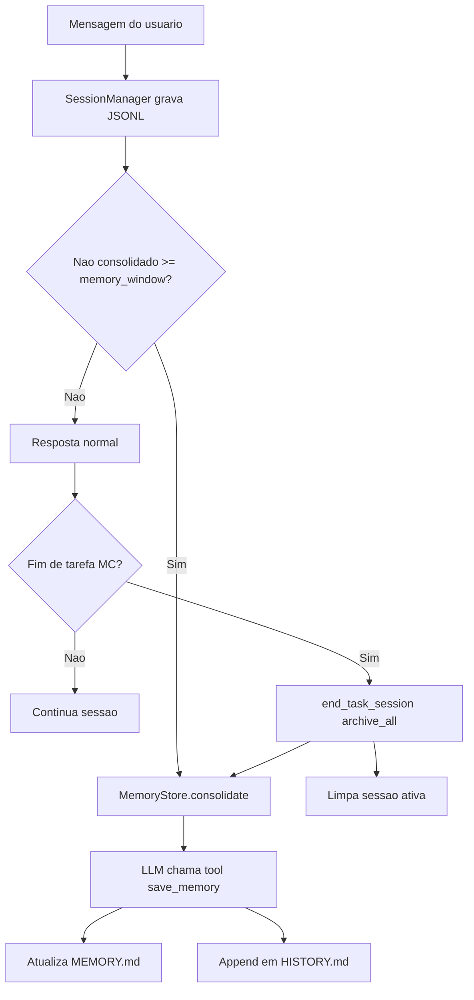
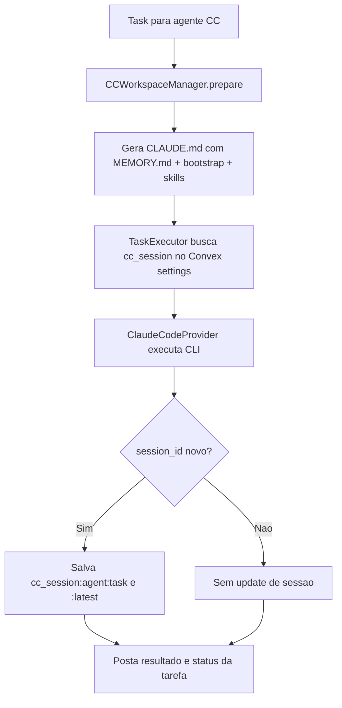
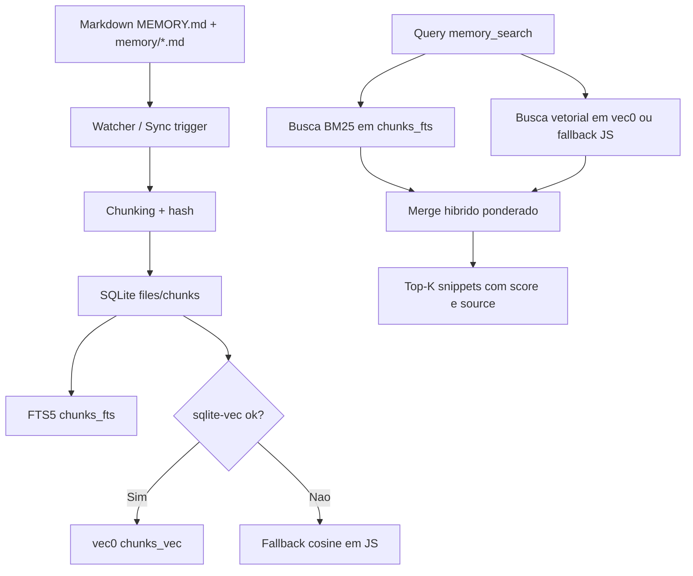

# Relatorio Tecnico: Memoria no nanobot, Claude CC e OpenClaw

Data da pesquisa: 2026-03-04

## Escopo

Este relatorio cobre:

1. Como funciona o sistema de memoria do `nanobot` (implementacao atual observada no codigo).
2. Como esta o sistema "novo" ligado ao `Claude CC` (Claude Code) em duas camadas:
   - modelo oficial do Claude Code (documentacao da Anthropic),
   - integracao `claude-code` dentro deste repositorio (`nanobot-ennio`).
3. Como o OpenClaw esta implementando memoria com `SQLite + vector database` (e o que costuma ser chamado na comunidade de "infinity memory").

## Metodologia (pesquisa profunda)

- Analise de codigo local do repositorio `nanobot-ennio` (pipeline real de execucao e memoria).
- Analise de historico de commits locais relacionados a memoria/CC.
- Leitura da discussao oficial do nanobot sobre o redesign de memoria.
- Leitura de documentacao e codigo do OpenClaw (docs + implementacao TypeScript).
- Leitura de documentacao oficial do Claude Code (Anthropic).

## 1) Sistema de memoria do nanobot (atual)

### 1.1 Estrutura-base

O design atual e de **duas camadas**:

- `memory/MEMORY.md`: memoria de longo prazo (fatos consolidados).
- `memory/HISTORY.md`: log append-only, orientado a busca textual/grep.

No codigo:

- `MemoryStore` define esse contrato e grava/le os dois arquivos.
- Existe lock de arquivo (`.memory.lock`) para reduzir corrida de escrita.

### 1.2 Fluxo de consolidacao

O agente guarda historico detalhado em sessao (`sessions/*.jsonl`) e, periodicamente, consolida:

- Quando o volume nao consolidado passa do `memory_window`.
- Em encerramento de tarefa (`end_task_session`), faz `archive_all=True` para consolidar tudo restante.

A consolidacao funciona por chamada de LLM com tool contract `save_memory`:

- `history_entry`: resumo temporal para `HISTORY.md`.
- `memory_update`: estado completo atualizado para `MEMORY.md`.

### 1.3 Injeção de memoria no contexto

Somente o conteudo de `MEMORY.md` entra diretamente no prompt de sistema.
`HISTORY.md` fica para busca/consulta fora do contexto principal.

### 1.4 Isolamento por board (modo clean vs with_history)

No Mission Control, ha dois modos por board/agente:

- `clean`:
  - board ganha `MEMORY.md` proprio (bootstrap a partir do global, se existir),
  - `HISTORY.md` comeca vazio por board.
- `with_history`:
  - `MEMORY.md` e `HISTORY.md` do board sao symlinks para memoria global do agente.

Isso permite controlar isolamento de contexto entre boards.

### 1.5 Arquivamento/restore de memoria

Quando agente e soft-deletado:

- gateway tenta arquivar `MEMORY.md`, `HISTORY.md` e sessoes para Convex.
- so remove pasta local depois de arquivar com sucesso.

Quando restaurado:

- escreve novamente arquivos de memoria/sessao locais a partir do archive.

### 1.6 Fluxograma (nanobot)

## 2) "Novo sistema" ligado ao Claude CC

Aqui existem **duas coisas diferentes** e complementares.

### 2.1 Claude Code oficial (Anthropic)

O Claude Code hoje trabalha com hierarquia de memoria por arquivos:

- memoria de usuario global,
- `CLAUDE.md` do projeto (compartilhado),
- `CLAUDE.local.md` (local, nao versionado),
- memoria de politicas enterprise.

Tambem suporta:

- imports em `CLAUDE.md`,
- atalhos (`#`) para adicionar memoria em arquivos corretos.

Em outras palavras: e um modelo de memoria **file-first**, com escopo hierarquico.

### 2.2 O que foi implementado no `nanobot-ennio` para CC

A integracao CC deste repositorio adicionou um "novo sistema" em relacao ao path antigo:

1. **Context parity no workspace do CC**
   - `CCWorkspaceManager` gera `CLAUDE.md` com:
     - identidade,
     - runtime,
     - bootstrap files (`AGENTS.md`, `USER.md`, `TOOLS.md`, `IDENTITY.md`),
     - memoria (`memory/MEMORY.md`),
     - skills e soul.
2. **Sessao persistente de Claude Code**
   - `TaskExecutor` busca `cc_session:{agent}:{task}` em `settings` (Convex),
   - passa `session_id` para `ClaudeCodeProvider` (`--resume`),
   - apos execucao, salva novo `session_id`.
3. **Chat CC persistente**
   - `ChatHandler` mantem chave `cc_session:{agent}:chat` para continuidade entre mensagens.

### 2.3 Timeline concreta (repositorio local)

- `2026-03-04`: `feat(cc-6) add session management for Claude Code agents`.
- `2026-03-04`: `feat(cc-9) add orientation, skills enrichment & AgentData parity for CC backend`.
- `2026-02-28`: `feat(executor) ... post-task memory consolidation` (path nanobot nao-CC).

### 2.4 Fluxograma (Claude CC no nanobot-ennio)

## 3) OpenClaw: "Infinity Memory" com SQLite + vector DB

### 3.1 Ponto critico: nome "Infinity Memory"

No OpenClaw atual, **"Infinity Memory" nao aparece como feature oficial com esse nome** na documentacao/codigo principal.
O que existe de forma oficial e:

- memoria canonica em Markdown,
- index derivado por agente em SQLite,
- busca hibrida BM25 + vetorial,
- aceleracao com `sqlite-vec` (`vec0`),
- backend alternativo QMD (experimental).

Ou seja: o que a comunidade chama de "infinity memory" normalmente e a combinacao de:

- armazenamento duravel textual + indexacao incremental + recall semantico/lexical.

### 3.2 Arquitetura oficial (builtin memory backend)

Camada 1 (source of truth):

- `MEMORY.md` e `memory/YYYY-MM-DD.md` no workspace.

Camada 2 (derived index):

- banco per-agent: `~/.openclaw/memory/<agentId>.sqlite` (configuravel).

Schema principal inclui:

- `files` (metadados dos arquivos indexados),
- `chunks` (trechos com embedding serializado),
- `chunks_fts` (FTS5 BM25),
- `chunks_vec` (virtual table `vec0` quando sqlite-vec esta disponivel).

### 3.3 Query path hibrido

Busca final combina:

- vetor (cosine distance/similarity),
- BM25 FTS5,
- score ponderado (`vectorWeight` + `textWeight` normalizados).

Quando `sqlite-vec` falha:

- sistema cai para fallback em JS (cosine em processo), sem derrubar o recurso.

### 3.4 Sincronizacao incremental

Indexacao e assíncrona, com:

- watcher em arquivos de memoria,
- sincronizacao em inicio de sessao e/ou na busca,
- deltas para transcritos de sessao (`deltaBytes`, `deltaMessages`).

### 3.5 Backend alternativo QMD

Opcionalmente:

- `memory.backend = "qmd"`,
- sidecar local que combina BM25 + vetores + reranking.

Se QMD falha, OpenClaw faz fallback para o backend SQLite builtin.

### 3.6 Fluxograma (OpenClaw SQLite + vector)

## 4) Comparativo direto

### nanobot

- Simplicidade extrema.
- Memoria operacional centrada em `MEMORY.md` + `HISTORY.md`.
- Consolidacao por LLM com contrato explicito (`save_memory`).
- Muito leve para operacao local.

### Claude Code (oficial)

- Hierarquia de escopos de memoria (enterprise/projeto/local/usuario).
- Forte controle por arquivo e praticidade via shortcuts/imports.

### OpenClaw

- Camada de indexacao mais rica para recall em escala.
- Arquitetura hibrida lexical + vetorial com fallback robusto.
- Mais superficie operacional (providers, sync, vetores, opcional QMD).

## 5) Conclusoes praticas

1. O redesign de memoria do nanobot (fev/2026) segue direcao de confiabilidade por simplicidade e arquivo-texto.
2. O "novo" no CC dentro deste repositorio e principalmente:
   - contexto parity (CLAUDE.md enriquecido com memoria e bootstrap),
   - persistencia/resume de sessao por task/chat via Convex settings.
3. O OpenClaw implementa hoje uma base muito proxima do que equipes chamam de "infinity memory": Markdown canonico + SQLite derivado + vetorial + BM25 + sync incremental.
4. Se objetivo for "memoria infinita" com boa auditabilidade:
   - manter Markdown como verdade canonica,
   - index derivado versionavel/rebuildavel,
   - fallback deterministico (sem dependencia unica do vector path).

## Fontes

### Repositorio local (codigo analisado)

- `/Users/ennio/Documents/nanobot-ennio/vendor/nanobot/nanobot/agent/memory.py`
- `/Users/ennio/Documents/nanobot-ennio/vendor/nanobot/nanobot/agent/loop.py`
- `/Users/ennio/Documents/nanobot-ennio/vendor/nanobot/nanobot/agent/context.py`
- `/Users/ennio/Documents/nanobot-ennio/mc/board_utils.py`
- `/Users/ennio/Documents/nanobot-ennio/mc/executor.py`
- `/Users/ennio/Documents/nanobot-ennio/mc/gateway.py`
- `/Users/ennio/Documents/nanobot-ennio/mc/chat_handler.py`
- `/Users/ennio/Documents/nanobot-ennio/vendor/claude-code/claude_code/workspace.py`
- `/Users/ennio/Documents/nanobot-ennio/vendor/claude-code/claude_code/provider.py`
- `/Users/ennio/Documents/nanobot-ennio/README.md`

### Fontes externas oficiais

- Discussao do redesign de memoria do nanobot:
  - https://github.com/HKUDS/nanobot/discussions/566
- Documentacao oficial Claude Code (memory):
  - https://docs.anthropic.com/en/docs/claude-code/memory
- OpenClaw memory concepts:
  - https://docs.openclaw.ai/concepts/memory
- OpenClaw code (implementacao SQLite/vector):
  - https://github.com/openclaw/openclaw/blob/main/src/memory/memory-schema.ts
  - https://github.com/openclaw/openclaw/blob/main/src/memory/manager-sync-ops.ts
  - https://github.com/openclaw/openclaw/blob/main/src/memory/manager-search.ts
  - https://github.com/openclaw/openclaw/blob/main/src/agents/memory-search.ts
- OpenClaw research notes (memoria v2 offline):
  - https://github.com/openclaw/openclaw/blob/main/docs/experiments/research/memory.md

